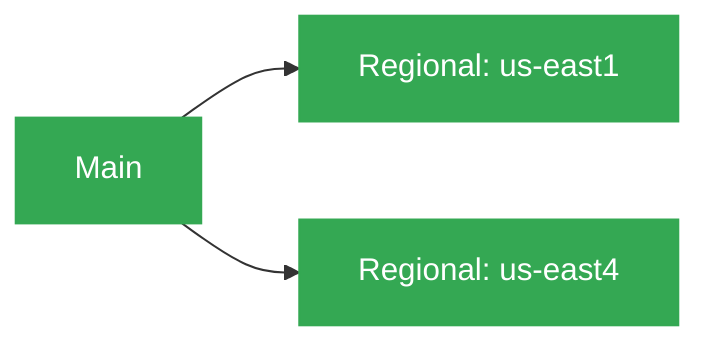

# Corpus

 

## Purpose

Corpus turns Logos team definitions into governed Google Cloud foundations. It provisions projects, shared networking, DNS, Artifact Registry, workload identity, encrypted OpenTofu state, Cloud SQL, and Datadog integrations across sandbox, non-production, and production.

## Consumer contract

| Consumers request | Corpus provides |
| --- | --- |
| Project enablement, required APIs, registry access, DNS, workload identity, and supported managed data services | CIS-aligned projects, Shared VPC connectivity, regional subnets and NAT, delegated DNS, Artifact Registry, CI/CD identities, encrypted state, and private managed-service connectivity |

Consumers do not manage shared VPC, state buckets, KMS, or platform IAM directly. Pneuma consumes Corpus project, network, DNS, and identity outputs to create Kubernetes workload environments.

### 🛠️ Tools

- [pre-commit](https://github.com/pre-commit/pre-commit)
- [osinfra-pre-commit-hooks](https://github.com/osinfra-io/pt-techne-pre-commit-hooks)

### 📋 Skills and Knowledge

Links to documentation and other resources required to develop and iterate in this repository successfully.

- [datadog cloud security posture management](https://docs.datadoghq.com/security/cloud_security_management/)
- [datadog google cloud integration](https://docs.datadoghq.com/integrations/google_cloud_platform/)
- [google artifact registry](https://cloud.google.com/artifact-registry/docs)
- [google cloud platform cis benchmarks](https://cloud.google.com/security-command-center/docs/cis-benchmarks)
- [google cloud platform iam](https://cloud.google.com/iam/docs/overview)
- [google cloud platform kms](https://cloud.google.com/kms/docs)
- [google cloud platform projects](https://cloud.google.com/resource-manager/docs/creating-managing-projects)
- [google cloud platform vpc networking](https://cloud.google.com/vpc/docs)
- [google kubernetes engine](https://cloud.google.com/kubernetes-engine/docs)
- [google private service access](https://cloud.google.com/vpc/docs/private-services-access)
- [google workload identity federation](https://cloud.google.com/iam/docs/workload-identity-federation)

## 🔄 Deployment Dependency Graph

Each environment deploys `main-{environment}` first, then `us-east1-{environment}` and `us-east4-{environment}` in parallel. Pull requests deploy sandbox, merges to `main` deploy non-production, and a successful non-production workflow promotes to production.

